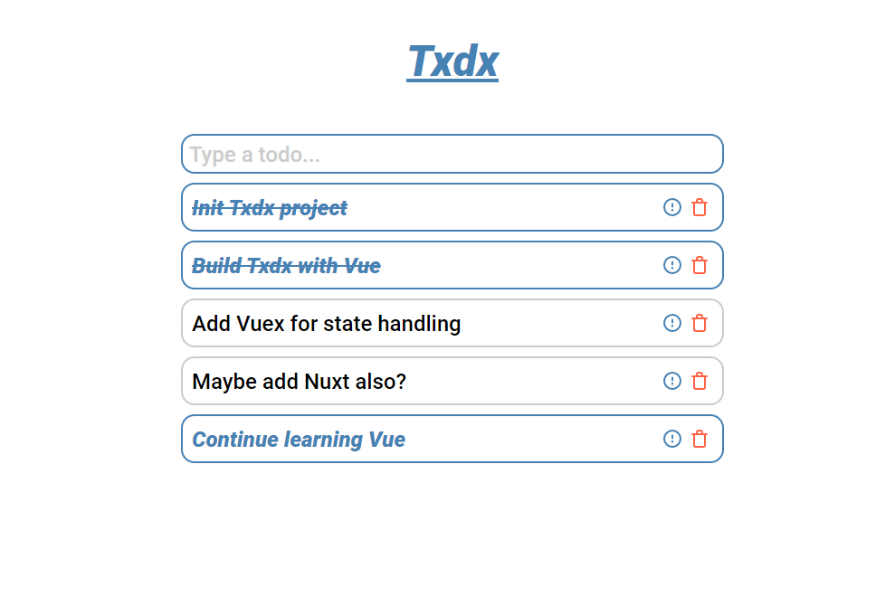
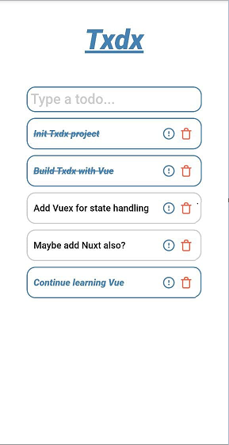

# Txdx

Txdx is todo list, just to learn Vue.

Install all dependencies:
```bash
yarn install
```

Start app:
```bash
yarn serve
```

* Type todo and hit Enter
* Toggle todo status by clicking on text
* Toggle todo priority by clicking on exclamation mark icon
* Delete todo by clicking on trash icon



